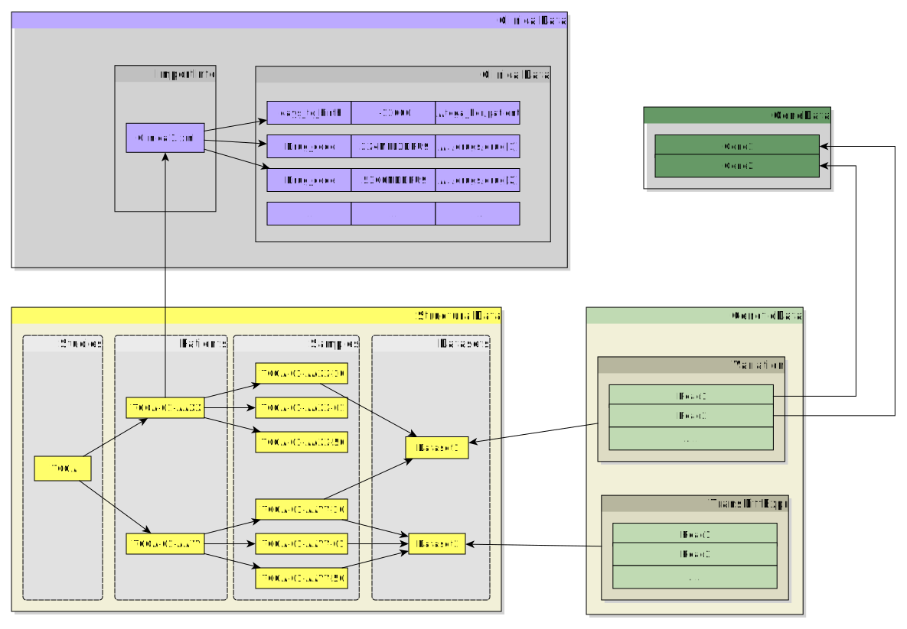
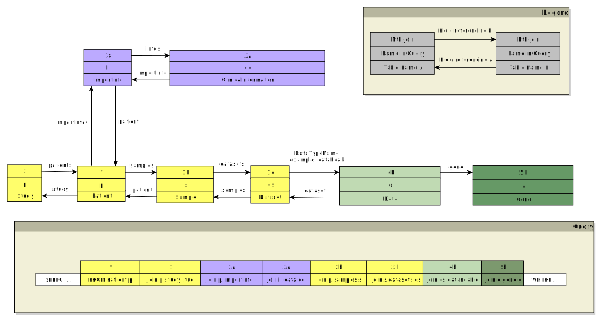

# Workflows

Analysis workflows enable high-level analysis on data queried from the CancerSysDB. To define an analysis workflow, a user basically has to take three steps:

* Define parametrized queries to retrieve data from the database
   * Define parameters to be chosen on the user frontend in order to individualize database queries in a controlled way
   * Define queries to get a subset of data from the database
* Define data processing steps in scripts for conversion, analysis and visualization
* Define output files of the workflows

A workflow can be defined by (1) specifying queries in the Hibernate Query Language (HQL) and further details on the workflow in a JSON-based format described below and (2) combining all analysis workflow scripts files in a zipped archive.

## JSON-based workflow description file

The JSON-based workflow description file (WDF) describes the entire concept of an analysis workflow:

* A scientific description of the workflow
* Definition of the parameters to be chosen on the user frontend ("InputParameters")
* The Exec Workflows which is a collection of scripts executed
   * Queries export data from the database into CSV files as input to the analysis scripts
   * Executable Workflows like R scripts use the data retrieved from the database ("ExcecutionCommands")
   * Definition of analysis result files ("outputFiles")

The code examples are based on the analysis workflow "Gene expression depending on mutation status".

### List of workflows

CologneWorkflow [description](CologneWorkflow.json) [sources](CologneWorkflow.zip)

MunichWorkflow [description](MunichWorkflow.json) [sources](MunichWorkflow.zip)

MunichWorkflow2 [description](MunichWorkflow2.json) [sources](MunichWorkflow2.zip)

SurvivalWorkflow[description](SurvivalWorkflow.json) [sources](SurvivalWorkflow.zip)

SurvivalWorkflow With Cohorts [description](SurvivalWorkflowWithCohort.json) [sources](SurvivalWorkflowWithCohort.zip)

TherapyWorkflow [description](TherapyWorkflow.json) [sources](TherapyWorkflow.zip)

WorkflowCNAsize [description](WorkflowCNAsize.json) [sources](WorkflowCNAsize.zip)

WorkflowCooccurance [description](WorkflowCooccurance.json) [sources](WorkflowCooccurance.zip)

WorkflowVartypes [description](WorkflowVartypes.json) [sources](WorkflowVartypes.zip)

### Workflow Description

#### Main fields

A short description of the workflow will be used as an item in the list of all workflows available on your instance of the CancerSysDB:
<pre><code class="json">"plainDescription": "Gene expression depending on mutation status"</code></pre>

A long description of the workflow should explain the scientific background of the workflow. _Warning:_ If you include formats in the long description, this could break the JSON Syntax!
<pre><code class="json">"longDescription":"Somatic mutations can severely impact the transcriptional activity of the genome, for instance if they occur in regulatory elements which alter gene expression. In this analysis tool, users can choose arbitrary cohorts from the CancerSysDB and profile gene expression or somatic copy number alterations of a specific gene depending on the mutation status of a different gene. Data are shown in a barplot across patients split into the cohorts selected. Furthermore, the differences in gene expression or somatic copy numbers between mutated an non-mutated patients are evaluated by a statistical test."</code></pre>

_Optional:_ The order in which the data appear on the workflow result page. The files themselves will be defined in the execution workflows. If this field is missing, the results will be set in random order.
<pre><code class="json">"outputFilesOrder":["FirstFile.svg","SecondFile.pdf","ThirdFile.csv"]</code></pre>

Finally, you need to provide a short name by which the workflow can be identified. This should match the name of the files uploaded:
<pre><code class="json">"sourceIdentifier": "CologneWorkflow"</code></pre>

#### Input parameters

The "InputParameters" field takes complex values. The input parameters describe the parameters that the user can choose. Each object in a list contains a parameter which can be chosen in an input dialogue on workflow execution.

Example 1:
<pre><code class="json">"InputParameters":[
  {
    "identifier": "expressionGene",
    "dataType":"Gene",
    "description": "expression of gene to compare to"
  },
  {
    "identifier": "mutationSplitGene",
    "dataType":"Gene",
    "description": "mutation status of Gene to Split data with"
  }
]
</code></pre>

Example 2:
<pre><code class="json">{
  "identifier": "PatientID1",
  "dataType":"String",
  "description": "Selected patient for comparison"
}
</code></pre>
  
Example 3:
<pre><code class="json">{
  "identifier": "TestList",
  "dataType":"List",
  "description": "A String based list of Things Imported"
}
</code></pre>
  

A single input parameter consists of three fields:
* The "identifier" can re-appear in the ExecWorkflow definition and will describe the value of the parameter for the entire workflow.
* The "dataType" describes the type of a stored value. This can be a basic datatype like a Float, Integer and String (following Java naming convention at http://docs.oracle.com/javase/tutorial/java/nutsandbolts/datatypes.html), a Gene or a List which will be interpreted as a List of Strings.
* The "description" describes the function of the parameter in a human-readable way.
* The field "optional" marks whether or not an input parameter is required. It can be either true or false (JSON boolean values). If left out, parameters are assumed to be required.

#### ExecWorkflows

An ExecWorkflow defines a special logic or script which is run on the command line to produce output. The field _execWorkflows_ takes a list of those executed in a row. If any script fails, the execution stops and the workflow execution has failed.

Example 1

<pre><code class="json">{
  "description":"Gene expression/copy number depending on mutation status",
  "outputFiles":{"showcase1_output.csv":"csv","showcase1_output.pdf":"pdf","showcase1_output.svg":"svg"},
  "ExcecutionCommands":["Rscript showcase1_analysis.R"],
  "VerificationCommands":["Rscript"],
  "setFiles":["showcase1_analysis.R"],
  "inputData":[
    {
      "OutputFields":["id","label","tumor_type","name","fpkm" ],
      "hqlQuery":"select s.id as id, p.sourceIdentifier as label, cancerType.abbreviation as tumor_type, g.name as name, a.fpkm as fpkm from DataTranscriptAbundance a join a.dataset ds join ds.samples s join s.patient p join a.gene g join s.tissueType tissueClass join s.cancerType cancerType where tissueClass.abbreviation= 'TP' and g= :expressionGene",
      "outputName":"query1.csv",
      "name":"one",
      "parametersForQuery":{"expressionGene":"expressionGene"}
    },
    {
      "OutputFields":["id"],
      "hqlQuery":"select distinct s.sourceIdentifier from DataVariation v join v.dataset ds join ds.samples s join s.tissueType tissueClass WHERE tissueClass.abbreviation= 'TP'",
      "outputName":"query2.csv",
      "name":"two"
    },
    {
      "OutputFields":["id","study" ],
      "parametersForQuery":{"mutationSplitGene":"mutationSplitGene"},
      "hqlQuery":"select distinct s.sourceIdentifier, stud.description from DataVariationAnnotation va join va.variation v join v.dataset ds join va.gene g join ds.samples s join s.tissueType tissueClass join s.patient p join p.study stud where g= :mutationSplitGene and tissueClass.abbreviation= 'TP'",
      "outputName":"query3.csv",
      "name":"three"
    }
  ]
}
</code> </pre>

Example 2

<pre><code class="json">{
  "description":"expression and mutation status of mitochondrial genes of selected patients and Combining individual files for visualization",
  "outputFiles":{"viz.html":"html","Logic.js":"js","data.csv":"csv"},
  "ExcecutionCommands":["python combine.py"],
  "VerificationCommands":[],
  "setFiles":["viz.html","combine.py"],
  "inputData": [
    {
      "OutputFields":["patient","gene", "func", "value", "mutation"],
      "hqlQuery":"select distinct p.sourceIdentifier, gf.gene.name , gf.process, tde.foldChange, 'NULL' from DataGeneticFunction gf, DataTranscriptDiffExpr tde  join tde.dataset ds join ds.samples samp join samp.patient p join gf.dataset dsGF  WHERE gf.gene = tde.gene and p.sourceIdentifier = :patient and dsGF.note='genes associated to mitochondria'",
      "outputName":"patient1.csv",
      "name":"one",
      "parametersForQuery":{"patient":"PatientID1"}
    },
    {
      "OutputFields":["patient","gene", "func", "value", "mutation"],
      "hqlQuery":"select distinct p.sourceIdentifier , gf.gene.name , gf.process, tde.foldChange,CONCAT('chr',gf.gene.chromosome,' ',gf.gene.startPos,' ',dv.refAllele,'/',dv.altAllele ) from DataGeneticFunction gf, DataTranscriptDiffExpr tde, DataVariationAnnotation dva join dva.variation dv  join tde.dataset ds join ds.samples samp join samp.patient p join dv.dataset dvds join dvds.samples dvsamp join dvsamp.patient dvp where gf.gene = tde.gene and dva.gene = tde.gene and p.sourceIdentifier  =dvp.sourceIdentifier  and p.sourceIdentifier= :patient",
      "outputName":"patientMutation1.csv",
      "name":"onemut",
      "parametersForQuery":{"patient":"PatientID1"}
     }
}</code> </pre>

An ExecWorkflow consists of the following fields:
* The field "ExcecutionCommands" lists the commands executed on the command line. In this case, an R script is called and uses the created fields.
* The field "VerificationCommands" lists the commands executed on the command line to check if everything is configured and installed on the server. In this example, it is checked whether R or the Rscript command line tool is installed.
* The "outputFiles" field is a map of file names created by the workflow.
   * Possible values are: 
      * svg: SVG will be rendered on the results page.
      * pic: Picture that can be displayed by HTML in the img tag. On click, will start to download.
      * csv: CSV (tab-delimited) with will be rendered as table and supplied as download link.
      * pdf: Creates a download link or preview (depending on browser settings).
      * html: Renders HTML file in iframe which can reference js files.
      * js: Will not be rendered, but can be referenced by the HTML file.
      * htmlsnippet: Piece of HTML code wich will be rendered into the results page.
* The "setFiles" field lists the files which are *important for the workflow execution*. These files *MUST* be included in the ZIP file. In this example, the only file is the R script for the workflow analysis.
* By default, the resulting CSV has no headers. If you want headers, please use "headers":true (optional)

#### inputData

Example 1:
<pre><code class="json">{
  "OutputFields":["id","label","tumor_type","name","fpkm" ],
  "hqlQuery":"select s.id as id, p.sourceIdentifier as label, cancerType.abbreviation as tumor_type, g.name as name, a.fpkm as fpkm from DataTranscriptAbundance a join a.dataset ds join ds.samples s join s.patient p join a.gene g join s.tissueType tissueClass join s.cancerType cancerType where tissueClass.abbreviation= 'TP' and g= :expressionGene",
  "outputName":"query1.csv",
  "name":"one",
  "parametersForQuery":{"expressionGene":"expressionGene"}
}
</code> </pre>

Example 2:
<pre><code class="json">{
  "OutputFields":["patient","gene", "func", "value", "mutation"],
  "hqlQuery":"select distinct p.sourceIdentifier, gf.gene.name , gf.process, tde.foldChange, 'NULL' from DataGeneticFunction gf, DataTranscriptDiffExpr tde  join tde.dataset ds join ds.samples samp join samp.patient p join gf.dataset dsGF  WHERE gf.gene = tde.gene and p.sourceIdentifier = :patient and dsGF.note='genes associated to mitochondria'",
  "outputName":"patient1.csv",
  "name":"one",
  "parametersForQuery":{"patient":"PatientID1"}
}</code> </pre>

The inputData section contains the following fields:
* "OutputFields" field defines the fields in the resulting CSV file from the HQL query.
* "hqlQuery" field contains the HQL query to the database. To test a query, please login as an administrator and use the HQL testing field.
* "parameterToFile" is a boolean value - if set to true, the HQL query can be left out. The specified parameter will be written into a file which can be used in the workflow. Important if the list input parameter is in use.
* "outputName" is the name of the file to be created.
* "name" is the internal name of the workflow.
* "parametersForQuery" field contains a list of the parameters used by the database.

## Description zip file

All files listed in the setFiles parameters of the ExecWorkflows section must be included into this zip file and uploaded alongside with the WDF. No containing folder is needed to do this.

## HQL queries

The HQL queries are used to take advantage of the Hibernate abstraction layer on the back-end of Grails. They should only be used by privileged users like administrators. They have to be defined to get data from the database.

https://docs.jboss.org/hibernate/orm/3.3/reference/en/html/queryhql.html

There is a test interface for HQL queries in the admin interface. HQL queries are very similiar to standard SQL. They support the naming conventions of the data classes in the Grails back-end (domain classes). 

### Best practice

#### General data model
This is the general data model of the CancerSysDB. There are four basic types of data:
           
* Structural data: all data that manages the patients and samples
* Molecular data: data that is derived from cancer genome analysis
* Clinical data: data associated to clinical course of a patient's disease
* Genomic annotation: information on genes and meta data about these genes

The relationships between these data types are illustrated in the following figure.

#### Fields

##### Structural data fields

To get an overview, the *Admin* has a field to test queries. This is an overview over the fields of the database. In general, the structural data has one must important field:

     sourceIdentifier

The Source Identifier carries information like the TCGA code of patients, samples etc.. In addition, every dataset has a

    note

field which can be handy to tag datasets with special information. The samples are supplied with fields called

    tissueType

and

    cancerType

with the fields

    name
    abbreviation
    code

Here is an example for a tissue type:

    name: Primary Blood Derived Cancer - Peripheral Blood
    abbreviation: TB
    code: 03

All the values follow the [TCGA vocabulary](https://gdc.cancer.gov/resources-tcga-users/tcga-code-tables/sample-type-codes). Here is another example for a cancer type:

    name: Uterine Corpus Endometrial Carcinoma
    abbreviation: UCEC
    code: 92582009

All the values follow the [TCGA vocabulary](https://gdc.cancer.gov/resources-tcga-users/tcga-code-tables/sample-type-codes) except for code which is the SNOMED ID.

#### Joining the data 

Here is an example how the database can be queried. If you use it, please costumize <i>Data</i> with the data you want to access from the molecular data. The documentation on molecular data types helps you to find the correct data type and the fields provided by the data types.
        

SELECT ... 
FROM Patient p join p.study stud

 join p.importinfo ii join ii.data cd 

 join p.samples s  join s.datasets ds

 join ds.dataPeak d 

join d.gene g 
WHERE ....

The HQL queries can start from the data or the structural data. _Example_:

<pre><code class="sql">select sp.sourceIdentifier, dv.freq from DataVariation dv join dv.dataset ds join ds.sample sp ....</pre></code>

Alternatively, you can use

<pre><code class="sql">select sp.sourceIdentifier, dv.freq from Sample sp join sp.datasets ds join ds.dataVariation dv ....</pre></code>

Here, DataVariation is used in the query, then the dataset _ds_ is joined, then the samples (_sp_) etc. Here is a generic example for an HQL join to connect the data you need for your workflow.

##### Clinical Data

In some workflows, it is necessary to join clinical patient data. The patient data is attached to the patient dataset. Between a clinical datum and the patient, there is an additional step called importInfo . This step reflects the origin of the patient data and resembles a data restriction point. 

<pre><code class="sql">ds.samples sp join sp.patient pt join pt.importInfos ii join ii.infos ci where ci.exactName = 'days_to_death'</pre></code>

This join shows how importInfos _ii_ are joined to the data. After joining the ImportInfo, the key/value pairs of the clinical data are joined:
<pre><code class="sql">join ii.infos ci</pre></code>

In the WHERE clause, the datum can be addressed by applying filters to key _ci.exactName_. The Value is stored in the field _value_.

#### Security

In general, the HQL queries are read-only, i.e. only select statements are allowed. The queries _MUST_ contain "_Dataset ds_" or "_dataset ds_" or  "_ImportInfo ii_" or  "_importInfo ii_" in the query. This is used to check user rights and add them to the query statement.

